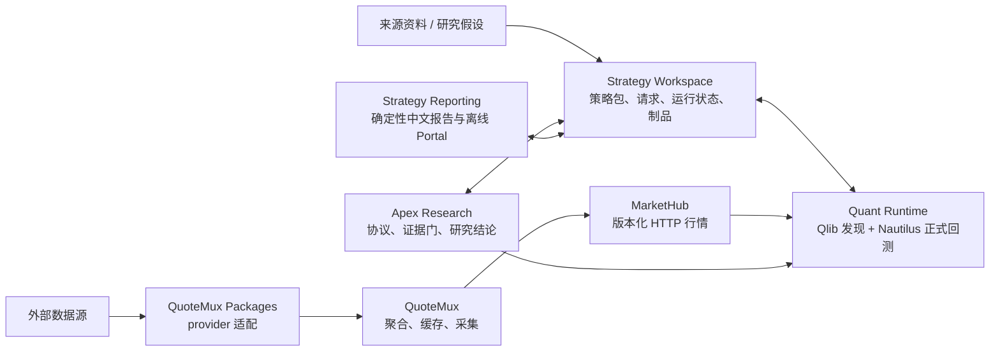

# QuantResearch 工作区

本仓库是 QuantResearch 工作区的轻量级外壳，保存共享导航、Agent 配置、机器可读的架构宪章与准入记录，以及验证各项目公共接口合同的跨仓验收工具，但不拥有各项目的具体实现。

每个项目目录都是独立 Git 仓库，拥有自己的 GitHub remote、历史、版本和提交。本仓库既不跟踪这些项目目录，也不把它们固定为 submodule。

## QuantResearch 策略研究架构

本文面向使用 QuantResearch 做策略分析的人。核心思路是：**先冻结策略与数据身份，再执行、研究判定和展示；每层只做自己拥有的事，所有结果都能追溯和复用。**

## 一张图看懂



`Strategy Workspace` 是中心控制面和事实目录；其他组件只通过它的公共 API/CLI 与不可变制品交互，不直接读取其 SQLite、私有目录或运行时数据库。

## 各层负责什么

| 层 | 负责 | 使用者应放进去的内容 |
| --- | --- | --- |
| `QuoteMux_Packages` / `QuoteMux` / `MarketHub` | provider 接入、聚合缓存、数据版本、覆盖与健康度 | 行情能力与数据修复；正式研究固定使用小电脑 `http://yosef-server:8803` |
| `strategy-workspace` | Strategy Package、参数合同、canonical request、run/attempt、不可变 record/artifact 和谱系 | 策略实现、参数 Schema、测试、请求样例；不要把研究判断或策略执行写进 Workspace |
| `quant-runtime` | generated-code sandbox、MarketHub preflight、Qlib discovery、Nautilus 正式执行、benchmark transport、candidate discovery 和 data-change observation | 运行请求；Qlib 结果只能是候选证据，正式订单、成交、账户、持仓和指标只认 Nautilus |
| `apex-research` | Campaign/Orchestrator、Candidate IR、权限预算、quality gates、外部研究接口、统计、Evidence v2、qualification、archives、benchmark、replication 和 revalidation | “为什么研究、下一步做什么、什么证据算通过”的研究设计与跨运行判断；不重算引擎指标 |
| `strategy-reporting` | 严格 read-model、campaign/replication/revalidation 中文报告、验证、重建和离线 Portal | 面向人的交付；只展示已发布 owner facts，不补算或猜测缺失结论 |

## 已交付研究能力（SPEC-001～SPEC-032）

| 能力组 | 当前能力 | 对应 SPEC |
| --- | --- | --- |
| 不可变研究对象 | 版本化 Research Campaign、Hypothesis，以及严格、确定性身份的 Factor/Model/Strategy Candidate IR；合格 Candidate 可转换为不可变 canonical Strategy Package。 | SPEC-001、003、028 |
| 可恢复研究编排 | 七态 Research Orchestrator、幂等推进、并发 claim、lease、崩溃恢复、失败记忆和 bounded context；所有昂贵动作受 campaign 权限、预算和审计约束。 | SPEC-002、006、011 |
| 安全接纳与执行 | 人工和 AI Candidate 统一经过静态门、Package intake、沙箱 behavioral conformance 和 MarketHub PIT preflight；generated code 受进程、能力、依赖和资源隔离。 | SPEC-004、005、009 |
| 外部研究扩展 | 通过 `ResearchEnginePort`、`EmpiricalResearchPort` 和受治理 External Research Runner 接入外部研究引擎或工具；RD-Agent 和 QRAFTI 只能在已证明的窄能力范围内工作。 | SPEC-007、008、019、020、029 |
| 有界研究策略 | 支持 focused refinement、冻结 validation matrix、多重检验控制、行为/niche 描述、探索/正式双档案、island evolution 和 Factor-Model co-evolution。 | SPEC-010、012、013、016、017、018、030 |
| 证据与研究资格 | Evidence v2 统一组合 Candidate、gate、Runtime、统计和负面证据；资格状态从 `idea` 逐级推进到 `research_qualified`，并保留 append-only history。 | SPEC-014、015 |
| Benchmark 与回归门 | 提供 AlphaForge-style 因子研究 benchmark、QuantCode-style 自然语言策略 benchmark，以及只读 canonical benchmark publication 的 CI regression gate。 | SPEC-023、024、025 |
| 报告与端到端证明 | 从公共 Workspace records 确定性生成 campaign JSON/HTML 和离线 Portal；golden campaign 已贯通 Candidate、Package、数据门、discovery、formal、Evidence、qualification 和报告。 | SPEC-026、027 |
| 复现与持续再验证 | 可冻结论文/文章来源、规则、假设和比较政策，产出 `exact`、`directional`、`failed` 或 `not_reproducible`；也可检测证据陈旧与因子衰减并启动有界 revalidation。 | SPEC-031、032 |

这些能力遵循一条固定边界：Apex 决定研究政策和证据含义，Runtime 产生受控的单次执行事实，Workspace 不可变保存与回读，Reporting 诚实展示。任何缺失、漂移、不可比较、依赖不可用或语义不唯一都必须显式 fail closed，不能静默换源、缩范围或 fallback。

有两项需要特别区分：

- [SPEC-021](https://github.com/williamxhero/Quant-Research/issues/40) 完成了 FINSABER 兼容性研究，结论为 `no_go / rejected-dependency`。
- [SPEC-022](https://github.com/williamxhero/Quant-Research/issues/41) 及 022A/022B 因上述前置决策关闭为 `not planned`；系统**没有**实现 FINSABER auxiliary validation lane，这不是遗漏开发。

完整的逐 SPEC 功能、owner 边界和未实现事项记录在本地 `docs/reports/SPEC-001-032功能交付总结-2026-09-10.md`。

## 推荐工作流

1. **冻结问题和政策。** 保存来源资料，把规则写成唯一可执行规格，并冻结数据、成本、验证矩阵、预算、统计和比较政策。区分来源事实、旧系统证据和研究假设。
2. **先查再建。** 用 Workspace 查询已有 Candidate、package、run、study、evidence 和 report；身份相同就复用。meaning-bearing 内容变化时创建新 revision/request，不覆盖旧对象。
3. **接纳 Candidate。** 使用 typed Factor/Model/Strategy IR；依次通过静态门、canonical Package intake 和沙箱 behavioral conformance。任何一门失败都不启动后续昂贵动作。
4. **先过数据门。** 用目标请求检查 MarketHub health、数据版本、coverage、catalog/calendar、PIT/as-of、调整、排序、重复和时间语义。数据不完整就暂停正式研究并修复 MarketHub，不缩短范围、不换源、不用 fixture 顶替。
5. **选择研究策略和执行拓扑。** 按目标选择 formal-only、discovery-formal、focused research、island/co-evolution、replication 或 revalidation；外部引擎和工具必须经过治理端口与 runner。
6. **执行、统计和判定。** 由 Apex 驱动 Runtime；已有 completed、identity-equivalent run 时优先 attach。正式结果形成 Evidence v2 后再执行统计控制、qualification 和 archive 更新。
7. **从证据生成报告并持续复验。** 用 Strategy Reporting 渲染、`verify` / `rebuild`；由 currency/decay policy 判断证据是否仍然 current，需要时创建新 revalidation，历史记录保持不可变。

`completed`、`rejected`、`blocked`、`not_evaluated` 和 `not_reproducible` 都是可审计的领域终态；`failed` 表示执行或基础设施故障，必须与研究拒绝区分。

## 如何选研究拓扑

| 目标 | 拓扑 | 说明 |
| --- | --- | --- |
| 验证一套已冻结规则 | `formal_only` | 默认选择；直接做一次 Nautilus 正式回测 |
| 先找候选，再正式验证 | `discovery_formal` | Qlib 负责发现，Nautilus 独立执行正式规则；两类结果不得混称 |
| 比较两套正式执行配置 | `formal_comparison` | 两个或更多 formal leg 做 A/B 比较 |
| 要求多套正式结果满足一致性 | `agreement_gate` | 在 comparison 上增加容差与通过门 |

## 最大化利用这套架构

- **把身份当缓存键。** package hash、参数、数据版本、范围、成本和执行配置相同，就复用既有对象；其中任何一项变化，创建新 revision/request，而不是覆盖旧结果。
- **把测试和正式结论分开。** fixture、短区间或小标的集适合验证结构与性能，但它们是独立请求，不能替代完整 live 数据上的正式结果。
- **把“研究通过”说准确。** Apex 的 `accept` 只代表声明的 evidence gates 通过，不自动代表样本外稳健、容量足够或可实盘。没有原生证据的能力标记为 `not_evaluated`。
- **优先复用已完成 run。** 新建 study 时可 attach 已完成且身份匹配的 run；同一份事实还能生成不同研究协议或重新构建报告，无需重复回测。
- **让每个问题回到 owner。** 数据问题修 MarketHub/QuoteMux，策略问题改 Strategy Package，执行问题改 Runtime，研究门改 Apex，展示问题改 Reporting。不要跨层读取私有文件或复制逻辑。
- **报告只做展示。** 所有收益、风险、交易和成本指标都应能回到同一个 completed run 的 Nautilus 原生证据；Reporting 不应成为新的计算层。

## 常用入口

```powershell
# 控制面：健康、已有运行和记录
strategy-workspace --root <workspace> doctor
strategy-workspace --root <workspace> run list
strategy-workspace --root <workspace> record list

# 单次正式执行，或对同一失败请求创建新 attempt
quant-runtime run --workspace <workspace> --package <package-dir> --request <request.json>
quant-runtime retry --workspace <workspace> --request-id <run-id>

# 完整研究：创建、运行，或复用已有 completed run
apex-research --workspace <workspace> study create <protocol.json>
apex-research --workspace <workspace> study run <study-id> --request <request.json>
apex-research --workspace <workspace> study attach <study-id> --run-id <run-id>

# 面向人的交付
strategy-reporting --workspace <workspace> render-study --study-id <study-id>
strategy-reporting --workspace <workspace> verify --report-id <report-id>
strategy-reporting --workspace <workspace> portal build --output <portal-dir>
```

对于要求正式执行的研究，完成证据链是：**冻结来源与规格 → typed Candidate 与质量门 → 可执行 Strategy Package → MarketHub 数据门 → terminal Runtime run → Evidence v2 与研究判定 → 可验证、可重建的报告。** 任一环缺失，都应明确停在哪一层。复现研究若无法形成唯一可执行语义，则应在正式 run 之前以 `not_reproducible` 闭合，不能把零执行描述成正式回测成功。

## 分层验收

`quantresearch-acceptance` 包是统一的测试规划与 L0～L3 执行入口。它接收严格的 acceptance-scope v2 文档、fixed-base diff，以及 `spec` 或 `release` 阶段。不可变计划会记录 owner、argv token、L0～L5 选择、基于每条命令 p95 推导的超时、marker、源文件到直接测试的映射、source fingerprint、JUnit/event 输出位置和唯一 canonical identity。未知字段、重复 JSON key、路径穿越、shell string、owner 不明确、未映射的 meaning-bearing 路径，以及基线或 fingerprint 漂移都会 fail closed。

```console
quantresearch-acceptance diff --scope scope.json --repository-root . --owner-root apex-research=../ApexResearch --output fixed-diff.json
quantresearch-acceptance select --scope scope.json --diff fixed-diff.json --phase spec
quantresearch-acceptance execute --scope scope.json --diff fixed-diff.json --phase spec --repository-root . --owner-root apex-research=../ApexResearch
quantresearch-acceptance audit --history durations.json
quantresearch-acceptance migrate --scope docs/architecture-admissions/spec-026a.acceptance-scope.v1.json
```

普通 pytest 命令默认排除 `slow`、`oci`、`connected` 和 `release`。单项超过 2 秒或单文件超过 60 秒的测试必须标记为 `slow` 并提供非空解释。每个 SPEC 都运行 L0～L2；只有公共合同变化才选择 L3，并且选定 wheel 集只构建、安装一次，然后在同一个 no-source 环境中完成两次 pytest 重放。L4 只在 5～8 个 SPEC 的检查点或最终发布时运行；L5 作为独立、真实、无 fallback 的状态报告。

Release ledger 只接受按顺序排列的 32 个 SPEC evidence reference，默认每 6 个 SPEC 设置一次检查点，支持恢复和幂等执行，并拒绝替换既有证据。审查修复会创建只包含修复触及路径的新 fixed-base diff，因此同一个 selector 只重跑新的影响集。SPEC-026A 的 v1 scope 作为历史机器可读证据保留，迁移时不会丢失已记录的测试层级或 installed tracer。
