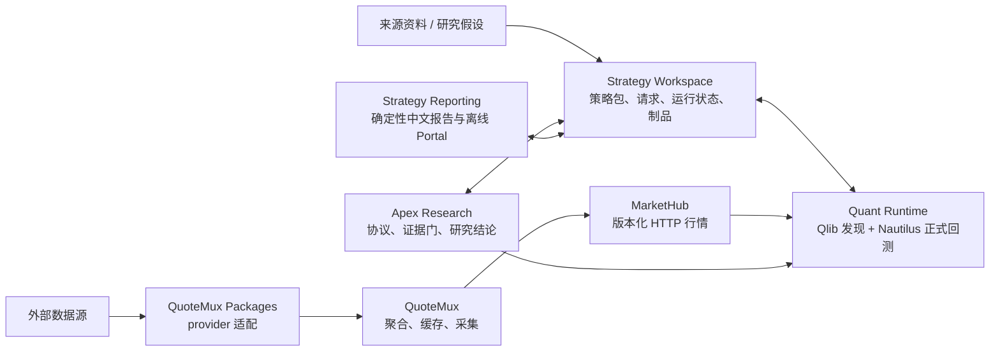

# QuantResearch 策略研究架构

本文面向使用 QuantResearch 做策略分析的人。核心思路是：**先冻结策略与数据身份，再执行、研究判定和展示；每层只做自己拥有的事，所有结果都能追溯和复用。**

## 一张图看懂



`Strategy Workspace` 是中心控制面和事实目录；其他组件只通过它的公共 API/CLI 与不可变制品交互，不直接读取其 SQLite、私有目录或运行时数据库。

## 各层负责什么

| 层 | 负责 | 使用者应放进去的内容 |
| --- | --- | --- |
| `QuoteMux_Packages` / `QuoteMux` / `MarketHub` | provider 接入、聚合缓存、数据版本、覆盖与健康度 | 行情能力与数据修复；正式研究固定使用小电脑 `http://yosef-server:8803` |
| `strategy-workspace` | Strategy Package、参数合同、canonical request、run/attempt、不可变制品和谱系 | 策略实现、参数 Schema、测试、请求样例；不要把策略写进 Runtime |
| `quant-runtime` | MarketHub 数据读取、执行拓扑、Qlib discovery、Nautilus 正式执行 | 运行请求；Qlib 结果只能是候选证据，正式订单、成交、账户、持仓和指标只认 Nautilus |
| `apex-research` | protocol、trial、gate、evidence、decision | “什么证据算通过”的研究设计，以及跨运行比较；不重算引擎指标 |
| `strategy-reporting` | 严格 read-model、中文 HTML、验证、重建和离线 Portal | 面向人的交付；只展示已发布证据，不补算或猜测缺失结论 |

## 推荐工作流

1. **冻结问题。** 保存来源资料，并把规则写成唯一可执行规格：标的池、频率、复权、信号时点、仓位、退出、资金、成本、滑点、日历和区间。区分来源事实、旧系统证据和研究假设。
2. **先查再建。** 用 Workspace 查询已有 package、run、study 和 report；身份相同就复用。策略逻辑或包内辅助文件变化时升级 package revision。
3. **先过数据门。** 用目标请求检查 MarketHub health、数据版本、coverage、catalog/calendar、排序、重复和时间语义。数据不完整就暂停正式研究并修复 MarketHub，不缩短范围、不换源、不用 fixture 顶替。
4. **选对拓扑。** 冻结 Strategy Package、参数、数据 snapshot 和执行配置后，再提交 canonical request。
5. **执行与判定。** 由 Apex Research 驱动 Runtime；已有 completed run 时用 `study attach` 接入研究，避免重跑。失败 run 保留原 attempt，修复后显式 retry。
6. **从证据生成报告。** 用 Strategy Reporting 渲染 run 或 study，随后 `verify` / `rebuild`；最终交付以 report/portal 为入口，以 Workspace 谱系为审计依据。

`completed` 与 `rejected` 都是可审计的正常终态；前者完成执行，后者表示研究门拒绝。`failed` 才是执行故障。

## 如何选研究拓扑

| 目标 | 拓扑 | 说明 |
| --- | --- | --- |
| 验证一套已冻结规则 | `formal_only` | 默认选择；直接做一次 Nautilus 正式回测 |
| 先找候选，再正式验证 | `discovery_formal` | Qlib 负责发现，Nautilus 独立执行正式规则；两类结果不得混称 |
| 比较两套正式执行配置 | `formal_comparison` | 两个或更多 formal leg 做 A/B 比较 |
| 要求多套正式结果满足一致性 | `agreement_gate` | 在 comparison 上增加容差与通过门 |

## 最大化利用这套架构

- **把身份当缓存键。** package hash、参数、数据版本、范围、成本和执行配置相同，就复用既有对象；其中任何一项变化，创建新 revision/request，而不是覆盖旧结果。
- **把测试和正式结论分开。** fixture、短区间或小标的集适合验证结构与性能，但它们是独立请求，不能替代完整 live 数据上的正式结果。
- **把“研究通过”说准确。** Apex 的 `accept` 只代表声明的 evidence gates 通过，不自动代表样本外稳健、容量足够或可实盘。没有原生证据的能力标记为 `not_evaluated`。
- **优先复用已完成 run。** 新建 study 时可 attach 已完成且身份匹配的 run；同一份事实还能生成不同研究协议或重新构建报告，无需重复回测。
- **让每个问题回到 owner。** 数据问题修 MarketHub/QuoteMux，策略问题改 Strategy Package，执行问题改 Runtime，研究门改 Apex，展示问题改 Reporting。不要跨层读取私有文件或复制逻辑。
- **报告只做展示。** 所有收益、风险、交易和成本指标都应能回到同一个 completed run 的 Nautilus 原生证据；Reporting 不应成为新的计算层。

## 常用入口

```powershell
# 控制面：健康、已有运行和记录
strategy-workspace --root <workspace> doctor
strategy-workspace --root <workspace> run list
strategy-workspace --root <workspace> record list

# 单次正式执行，或对同一失败请求创建新 attempt
quant-runtime run --workspace <workspace> --package <package-dir> --request <request.json>
quant-runtime retry --workspace <workspace> --request-id <run-id>

# 完整研究：创建、运行，或复用已有 completed run
apex-research --workspace <workspace> study create <protocol.json>
apex-research --workspace <workspace> study run <study-id> --request <request.json>
apex-research --workspace <workspace> study attach <study-id> --run-id <run-id>

# 面向人的交付
strategy-reporting --workspace <workspace> render-study --study-id <study-id>
strategy-reporting --workspace <workspace> verify --report-id <report-id>
strategy-reporting --workspace <workspace> portal build --output <portal-dir>
```

判断研究是否真正完成，只看一条证据链：**冻结来源与规格 → 可执行 Strategy Package → 通过 MarketHub 数据门 → terminal Runtime run → Apex evidence/decision → 可验证、可重建的报告。** 任一环缺失，都应明确停在哪一层，而不是把部分完成描述成正式结论。
